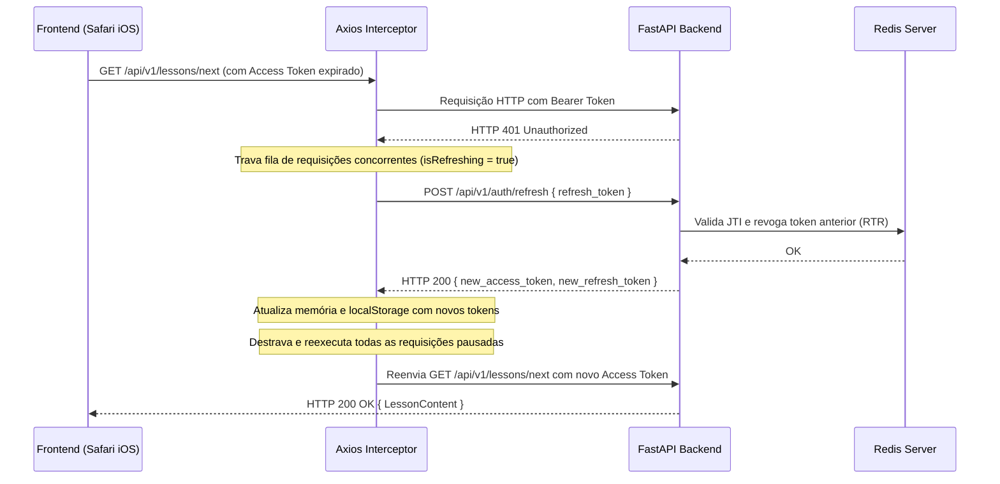

# 🏛️ Plano de Arquitetura da Fase 3: Interface e Sala de Aula (Frontend) - Latium AI

Este documento estabelece o planejamento técnico rigoroso para a construção da interface do **Latium AI**, projetada especificamente com filosofia **Mobile-First** (otimizada para o Safari no iOS), rápida, responsiva e integrada ao ecossistema FastAPI + PostgreSQL + Redis já consolidado.

---

## 1. Stack Tecnológica Escolhida para o Frontend

### Decisão: **React 18/19 + Vite (TypeScript) + TailwindCSS**

#### Justificativa Técnica vs. Next.js:
1. **Velocidade e Desempenho no Safari Mobile:**
   - O Vite utiliza compilação nativa em ESM no desenvolvimento e empacotamento otimizado via Rollup no build de produção. Isso elimina a sobrecarga de hidratação e complexidade de servidores Node intermediários que o Next.js imporia dentro do Docker em ambiente de desenvolvimento.
2. **Experiência de App Nativo (Mobile-First & PWA):**
   - Como o foco primário é a experiência no Safari do iPhone, uma Single Page Application (SPA) bem estruturada com React + Vite oferece transições de tela instantâneas, controle granular de touch targets (mínimo de 44x44px), respeito às *Safe Areas* do iOS (`env(safe-area-inset-top)` e `env(safe-area-inset-bottom)`) e eliminação de atrasos de clique (`touch-action: manipulation`).
3. **Paridade e Leveza no Docker Compose:**
   - O container de desenvolvimento do Vite sobe em menos de 2 segundos no Docker e consome menos de 100MB de RAM, permitindo recarga em tempo real (HMR) sem travamentos.
4. **TailwindCSS + Lucide Icons:**
   - Estilização utilitária minimalista, harmoniosa e com design system coerente (paleta clássica: tons de mármore, dourado imperial, azul biblioteca e ardósia escura).

*(Nota: Caso o Tech Lead prefira expressamente Next.js com App Router por exigências futuras de SEO para landing pages públicas, o projeto poderá ser adaptado com facilidade).*

---

## 2. Estrutura de Pastas e Componentes

Adotaremos uma arquitetura modular por funcionalidades (*feature-based* e *atomic UI*):

```text
frontend/
├── Dockerfile                   # Build de desenvolvimento (Node 20 Alpine) e NGINX para prod
├── package.json
├── tsconfig.json
├── vite.config.ts               # Proxy reverso para o backend FastAPI e porta 5173
├── tailwind.config.js
├── postcss.config.js
├── index.html                   # Meta tags mobile, viewport viewport-fit=cover para iPhone
└── src/
    ├── main.tsx                 # Entrypoint da aplicação
    ├── App.tsx                  # Provedores de contexto e roteamento
    ├── index.css                # Variáveis CSS, fontes serifadas/sans e safe-area iOS
    ├── api/
    │   ├── client.ts            # Instância Axios configurada com baseURL e interceptors
    │   ├── authApi.ts           # Chamadas de login, register, refresh e me
    │   └── lessonApi.ts         # Chamadas de módulos, progresso, next lesson e complete
    ├── types/
    │   ├── auth.ts              # Tipos de Usuário, Tokens, LoginRequest
    │   ├── lesson.ts            # Tipos de LessonContent, Theory, Vocabulary, Exercises
    │   └── progress.ts          # Tipos de UserProgress, CourseModule
    ├── context/
    │   ├── AuthContext.tsx       # Estado global de autenticação (user, tokens, login, logout)
    │   └── ProgressContext.tsx   # Estado do progresso do aluno e lição ativa
    ├── hooks/
    │   ├── useAuth.ts           # Hook consumidor do AuthContext
    │   └── useProgress.ts       # Hook consumidor do ProgressContext
    ├── components/
    │   ├── ui/                  # Componentes reutilizáveis (Design System)
    │   │   ├── Button.tsx
    │   │   ├── Input.tsx
    │   │   ├── Card.tsx
    │   │   ├── Badge.tsx
    │   │   ├── ProgressBar.tsx
    │   │   └── Modal.tsx
    │   ├── layout/              # Estrutura de navegação responsiva
    │   │   ├── Header.tsx       # Top bar com streak de dias, pontos e perfil
    │   │   ├── MobileNav.tsx    # Bottom navigation bar nativa para iOS
    │   │   └── AppShell.tsx     # Wrapper com suporte a safe-area do iPhone
    │   ├── auth/                # Componentes de autenticação
    │   │   ├── LoginForm.tsx    # Formulário OAuth2 com validação
    │   │   └── RegisterForm.tsx # Formulário de cadastro de aluno
    │   ├── dashboard/           # Tela inicial do aluno
    │   │   ├── WelcomeBanner.tsx
    │   │   ├── CurrentLessonCard.tsx # Destaque da próxima aula com botão de ação
    │   │   ├── ModuleAccordion.tsx   # Visualização da trilha e capítulos
    │   │   └── StatsOverview.tsx     # Pontos acumulados e lições concluídas
    │   └── classroom/           # A Sala de Aula Interativa
    │       ├── LessonHeader.tsx      # Barra de progresso da aula
    │       ├── TheorySection.tsx     # Explicação gramatical formatada
    │       ├── ExamplesList.tsx      # Frases latinas clássicas com tradução
    │       ├── VocabularyCards.tsx   # Cards interativos com lema e morfologia
    │       ├── ExerciseRunner.tsx    # Motor de exercícios interativos (múltipla escolha/tradução)
    │       └── TeacherTip.tsx        # Dica final do Magister Latium
    └── pages/
        ├── LoginPage.tsx        # Página de login com alternância para cadastro
        ├── RegisterPage.tsx
        ├── DashboardPage.tsx    # Visão geral da jornada do aluno
        └── ClassroomPage.tsx    # Experiência imersiva da aula
```

---

## 3. Gestão de Autenticação e Tokens no Navegador (Segurança)

Para conciliar a máxima segurança contra ataques XSS/CSRF e garantir que o aluno não seja deslogado a cada fechamento de aba no Safari do iPhone:

### Mecânica de Armazenamento de Tokens:
1. **Access Token (Curta Duração - 15 min):**
   - Mantido prioritariamente no **estado da memória do React (`AuthContext`)**.
   - Em caso de recarga de página (F5), o token é recuperado silenciosamente via `POST /api/v1/auth/refresh`.
2. **Refresh Token (Longa Duração - 7 dias):**
   - Armazenado no `localStorage` sob a chave segura `latium_refresh_token` (ou em cookie com flags `SameSite=Lax`).
   - Controlado ativamente pelo Redis no backend, com rotação obrigatória a cada uso.

### Ciclo de Interceptação Axios e Fila de Requisições (Mutex):
Implementaremos um interceptor assíncrono rigoroso para lidar com expiração transparente:



Se o refresh token estiver expirado ou tiver sido revogado no Redis (ex: tentativa de reuso malicioso), o interceptor cancela a fila, limpa os dados locais e redireciona suavemente o aluno para `/login`.

---

## 4. Atualizações no `docker-compose.yml`

O serviço `frontend` será integrado ao `docker-compose.yml` orquestrado com as seguintes diretrizes:
- Porta exposta: `5173:5173`.
- Dependência: Aguarda o `backend` estar ativo.
- Mapeamento de volumes para Hot Reload instantâneo (`./frontend:/app`), preservando `node_modules` isolado no container.
- Configuração de proxy no `vite.config.ts` para que chamadas `/api` sejam encaminhadas internamente para `http://backend:8000`, evitando qualquer problema de CORS ou endereçamento de rede entre containers e o host.

### Trecho a ser adicionado ao `docker-compose.yml`:
```yaml
  frontend:
    build:
      context: ./frontend
      dockerfile: Dockerfile
    container_name: latium_frontend
    restart: unless-stopped
    ports:
      - "5173:5173"
    environment:
      - VITE_API_BASE_URL=http://localhost:8001/api/v1
    volumes:
      - ./frontend:/app
      - /app/node_modules
    depends_on:
      - backend
    command: npm run dev -- --host 0.0.0.0 --port 5173
```

---

## 5. Próximos Passos para Execução (Após Aprovação)

1. **Setup Inicial**: Inicializar o projeto Vite com TypeScript e TailwindCSS via container Node (`docker run`).
2. **Infraestrutura**: Criar o `Dockerfile` do frontend e atualizar o `docker-compose.yml`.
3. **Core & API Client**: Implementar os tipos TypeScript, cliente Axios e interceptors com tratamento de RTR.
4. **Contextos & Telas**:
   - Desenvolver `AuthContext` e as páginas de Login e Registro.
   - Desenvolver `DashboardPage` com trilha de módulos, lições e estatísticas do aluno.
   - Desenvolver a interface da **Sala de Aula (`ClassroomPage`)**, renderizando teoria, vocabulário e exercícios gerados pelo Magister Latium.
5. **Validação**: Testar responsividade mobile (emulação Safari iPhone) e fluxo ponta a ponta de autenticação e conclusão de aula.
