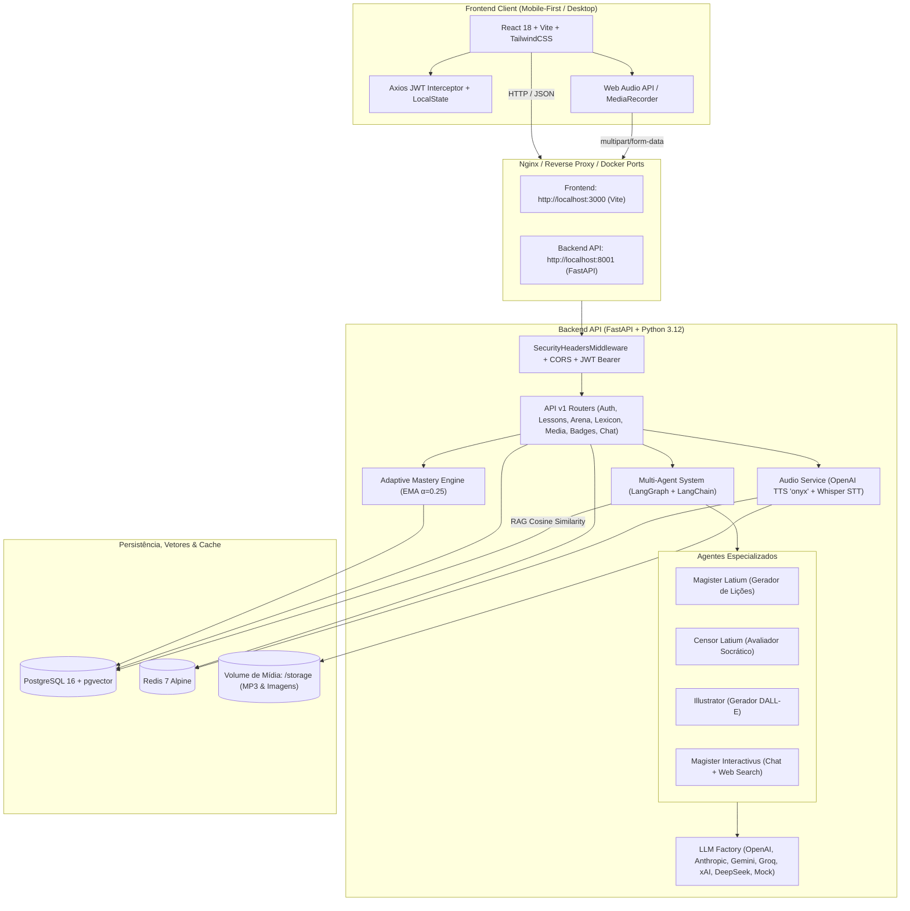

# 🏛️ Latium AI — Intelligent Latin Tutoring Platform

[](https://github.com/rpaplaus/LATIN_CLASS/actions/workflows/ci.yml)
[](https://www.python.org/)
[](https://fastapi.tiangolo.com/)
[](https://react.dev/)
[](https://www.typescriptlang.org/)
[](https://vitejs.dev/)
[](https://tailwindcss.com/)
[](https://github.com/pgvector/pgvector)
[](https://redis.io/)
[](https://www.docker.com/)
[](https://github.com/astral-sh/ruff)
[](https://mypy.readthedocs.io/)

Plataforma inteligente, adaptativa e *mobile-first* para o ensino e maestria da língua latina clássica. O **Latium AI** une a pedagogia humanística do **Método Natural** (*Lingua Latina Per Se Illustrata* — Hans H. Ørberg) ao estado da arte em orquestração multi-agente de Inteligência Artificial, avaliação fonética por voz (*Pronuntiatio Restituta*), retenção adaptativa com contenção estrita de custos de LLM e gamificação imersiva inspirada no Senado Romano (*Cursus Honorum*).

---

## 🎯 Escopo do Projeto

O **Latium AI** foi projetado para superar as barreiras do ensino tradicional de latim (memorização descontextualizada de tabelas e tradução mecânica contínua), proporcionando uma experiência de imersão progressiva onde a língua é assimilada organicamente através do contexto, da audição clássica e da prática ativa.

### Pilares Pedagógicos Centrais

1. **Método Natural Indutivo:** Aprendizado do latim através do próprio latim. O aluno desenvolve intuição gramatical e assimila novos termos por meio de pistas contextuais, ilustrações históricas e gradação sintática suave.
2. **Pronúncia Clássica Restituída (*Pronuntiatio Restituta*):** Ênfase na fonética canônica do período cesariano/augustano (ex.: consoante *C* sempre oclusiva velar `/k/`, *V* pronunciado como semivogal `/w/`, ditongos abertos *ae* `/ae̯/` e *oe* `/oe̯/`), com laboratório de voz integrado.
3. **Avaliação Socrática Corretiva (*Censor Latium*):** Em vez de meras mensagens de "certo" ou "errado", o agente socrático diagnostica a raiz do equívoco morfológico ou sintático, orientando o aluno com dicas construtivas em latim e português.
4. **Governança Estrita de Custos de LLM:** Arquitetura desenhada para máxima retenção de longo prazo sem onerar a inferência de IA:
   - **Zero Custo de Tokens:** O *Tabularium* (histórico) e o *Lexicon Universale* operam 100% sobre dados relacionais e JSONB no PostgreSQL, com áudios cacheados localmente.
   - **Prompts Míni (< 150 tokens):** Treinamento gladiatório na *Arena Latium* com geração ultracompacta.
   - **Avaliação em Duas Camadas:** Respostas na Arena passam primeiro por heurística léxica local (0 tokens); apenas divergências complexas acionam o Censor Míni (< 40 tokens).
   - **Cache Determinístico:** Áudios TTS e ilustrações são indexados por hash SHA-256 no Redis e disco permanente.

### Módulos do Ecossistema

```
┌─────────────────────────────────────────────────────────────────────────────────────────────┐
│                                   ECOSSISTEMA LATIUM AI                                     │
├──────────────────────────────┬──────────────────────────────┬───────────────────────────────┤
│    AULAS & APRENDIZADO       │     PRÁTICA & RETENÇÃO       │      VOZ, CULTURA & CHAT      │
├──────────────────────────────┼──────────────────────────────┼───────────────────────────────┤
│ • Magister Latium (Professor)│ • Arena Latium (Flashcards)  │ • Schola Pronuntiationis (STT)│
│ • Censor Latium (Avaliador)  │ • Lexicon Universale (Dicio) │ • Síntese de Voz Clássica(TTS)│
│ • Motor Adaptativo (EMA)     │ • Pugillares (Favoritos)     │ • Magister Interactivus (Chat)│
│ • RAG Biblioteca Alexandria  │ • Tabularium (Pergaminhos)   │ • Trivia Antiqua & Web Search │
└──────────────────────────────┴──────────────────────────────┴───────────────────────────────┘
```

- **Magister Latium & Aulas Guiadas:** Geração de lições personalizadas compostas por leitura clássica, vocabulário contextual, notas morfológicas, ilustrações arqueológicas e exercícios socráticos.
- **Motor Adaptativo de Proficiência (EMA):** Rastreamento contínuo das competências gramaticais do estudante (casos, declinações, conjugações) modelado por Média Móvel Exponencial ($\alpha = 0.25$), identificando vulnerabilidades e retroalimentando o gerador de lições.
- **Tabularium (Arquivo de Pergaminhos):** Sala capitular de revisão de todas as lições concluídas, pontuações históricas e áudios originais sem consumo de tokens de IA.
- **Lexicon Universale & Pugillares:** Dicionário unificado com desduplicação em tempo real de vocábulos assimilados nas aulas, busca instantânea, filtros por classe morfológica e tabuinhas de cera pessoais (*Pugillares*) para favoritar termos.
- **Arena Latium:** Minigame gladiatório adaptativo com cartões 3D flip e áudio nativo, focado na fraqueza gramatical de maior vulnerabilidade do aluno.
- **Schola Pronuntiationis (Laboratório de Fonética):** Gravação de voz direta via navegador com análise fonética palavra por palavra baseada no Whisper STT e regras da *Pronuntiatio Restituta*.
- **Magister Interactivus & Trivia Antiqua:** Assistente conversacional em gaveta lateral expansível (*side-drawer*) com RAG no acervo clássico da Biblioteca de Alexandria, busca arqueológica ao vivo na Web e curiosidades históricas imperiais.
- **Senado Romano & Gamificação (*Cursus Honorum*):** Sistema canônico de progressão (*Tiro*, *Discipulus*, *Grammaticus*, *Rhetor*, *Magister Latium*), ofensivas diárias (*dies consecuti*), pontos de experiência (XP) e insígnias em 4 níveis (Bronze, Prata, Ouro e Louro).

---

## 📐 Arquitetura & Stack Tecnológica

O Latium AI opera sob uma arquitetura de serviços moderna, desacoplada e conteinerizada, garantindo latência mínima, tipagem estática rigorosa de ponta a ponta e alta resiliência.

### Diagrama Arquitetural



### Detalhamento da Stack

#### Backend & API
- **FastAPI (0.115+):** Framework assíncrono de altíssima performance para construção de APIs RESTful baseadas em padrões abertos (OpenAPI / JSON Schema).
- **Python 3.12:** Utilização de recursos modernos de tipagem (`type`, `Self`, `match/case`) auditados com **Mypy em Modo Estrito (Strict Mode)**.
- **SQLAlchemy 2.0 (Async) + asyncpg:** Comunicação não-bloqueante com o banco de dados relacional via pooling de conexões assíncronas.
- **PostgreSQL 16 com pgvector:** Banco relacional para dados de usuários, progresso, lições (JSONB) e armazenamento de vetores para busca semântica (*RAG Cosine Similarity*).
- **Redis 7 (Alpine):** Armazenamento chave-valor em memória para cache de sessões, invalidação de JWT, rate limiting adaptativo e cache determinístico de hashes de áudio SHA-256.
- **Alembic:** Sistema robusto de controle de versão e aplicação de migrações assíncronas de esquema do banco.
- **Segurança Defensiva:**
  - Padrão OAuth2 Password Flow com tokens JWT assinados via HMAC-SHA256 (`HS256`).
  - Refresh tokens rotativos persistentes no banco com revogação instantânea via Redis.
  - Hashing de senhas com algoritmo `bcrypt` via Passlib.
  - Middleware de cabeçalhos de segurança (`X-Frame-Options`, `X-Content-Type-Options`, `Content-Security-Policy`).
  - Mascaramento global de erros 500 com identificador único de correlação (*Correlation ID*).
- **Orquestração de Agentes & IA:**
  - **LangGraph & LangChain Core:** Coordenação de fluxos conversacionais e execução condicional de ferramentas.
  - **LLM Factory Multi-Provedor:** Abstração unificada que suporta alternância transparente entre **OpenAI** (`gpt-4o`, `gpt-4o-mini`), **Anthropic** (`claude-3-5-sonnet`), **Google Gemini** (`gemini-1.5-pro/flash`), **Groq** (`llama-3.1-70b`), **xAI**, **DeepSeek** e modo **Mock** resiliente para suítes de testes sem custos de rede.
  - **OpenAI TTS & Whisper STT:** Síntese de fala latina na voz clássica *onyx* e transcrição fonética com validação de regras canônicas da *Pronuntiatio Restituta*.

#### Frontend & Interface
- **React 18:** Arquitetura declarativa baseada em componentes funcionais e hooks customizados.
- **TypeScript 5.6:** Tipagem estrita de contratos de dados, payloads de API e componentes de interface.
- **Vite 5.4:** Bundler e ambiente de desenvolvimento ultrarrápido com Hot Module Replacement (HMR) e divisão inteligente de pacotes (*Code Splitting* com `React.lazy`).
- **Tailwind CSS 3.4:** Sistema de design canônico clássico com suporte a utilitários de perspectiva 3D (`perspective-1000`, `transform-style-3d`, `rotate-y-180`) para a Arena.
- **Design System Imperial:**
  - *Mármore Suave:* Fundos imersivos em tom marfim/papiro suave (`#fdfbf7`).
  - *Ardósia Romana:* Superfícies de alto contraste e legibilidade (`slate-900`, `slate-950`).
  - *Dourado Imperial:* Acentos áureos de triunfo e maestria (`amber-400`, `amber-500`, `#d4af37`).
  - *Carmim Gladiatório:* Destaques de ação e desafio na Arena Latium (`red-900`, `red-950`).
- **Web Audio API & MediaRecorder:** Captura e reprodução nativa de áudio no navegador com equalizador visual e estados de gravação fluidos.
- **Lucide React:** Biblioteca de ícones semânticos para clareza visual e acessibilidade.
- **Axios:** Cliente HTTP com interceptors transparentes para injeção de token Bearer e renovação automática de sessão via refresh token.

#### Infraestrutura & Conteinerização
- **Docker & Docker Compose:** Ambientes reproduzíveis e isolados para PostgreSQL, Redis, Backend e Frontend.
- **Volumes Persistentes:** Volumes nomeados para preservação de dados relacionais (`latium_postgres_data`), dados de cache (`latium_redis_data`) e arquivos de mídia gerados.

---

## 🛡️ Qualidade & CI/CD

O projeto adota uma esteira de integração contínua (CI) rigorosa gerenciada via **GitHub Actions** ([`.github/workflows/ci.yml`](file:///.github/workflows/ci.yml)), garantindo conformidade arquitetural a cada `push` e `pull_request` nos branches `main` e `master`.

### Estrutura dos Pipelines

```
GitHub Actions: CI Quality & Test Pipeline
├── 1. backend-quality-and-tests (Ubuntu Latest)
│   ├── Services: PostgreSQL 16 (pgvector) + Redis 7 Alpine
│   ├── Python 3.12 (Cache Pip)
│   ├── Ruff Check (Linting de código estrito)
│   ├── Ruff Format Check (Validação de formatação)
│   ├── Mypy Strict Mode (Checagem estática de tipos em app e tests)
│   ├── Alembic Upgrade Head (Validação real de migrações de banco)
│   └── Pytest Suite (Execução assíncrona + Relatório de Cobertura pytest-cov)
└── 2. frontend-quality-and-build (Ubuntu Latest)
    ├── Node.js 20 (Cache NPM)
    ├── NPM Clean Install (npm ci)
    └── Typecheck & Build (tsc && vite build - Zero erros de tipos e bundle validado)
```

### Políticas de Qualidade
- **Zero Warnings / Zero Errors:** O linter e o typechecker falham a pipeline se houver qualquer infração ou tipo inseguro (`Any` implícito).
- **Isolamento Total em Testes:** A suíte de testes de backend utiliza contêineres reais de banco e cache dedicados, combinados ao provedor `LLM_PROVIDER=mock`, permitindo execução completa de ponta a ponta sem chamadas externas pagas.

---

## 🚀 Como Executar

### 1. Pré-requisitos
- **Docker** (v24.0+) e **Docker Compose** (v2.20+)
- *Opcional (para execução no host sem contêiner):* **Python 3.12+** e **Node.js 20+**

### 2. Configuração de Variáveis de Ambiente
Copie o arquivo de exemplo e configure suas chaves de API:

```bash
cp .env.example .env
```

Edite o arquivo `.env` para informar as chaves das LLMs desejadas (como `OPENAI_API_KEY`, `GEMINI_API_KEY` ou `ANTHROPIC_API_KEY`). Para desenvolvimento local offline, a plataforma inicializa automaticamente em modo `mock` ou utiliza decks canônicos de contingência.

---

### 3. Executando com Docker Compose (Modo Recomendado — Full Stack)

Este modo sobe todos os 4 serviços interconectados em redes isoladas:

```bash
# 1. Iniciar todos os serviços (Postgres, Redis, Backend e Frontend)
docker compose up -d

# 2. Aplicar as migrações assíncronas do banco de dados
docker compose exec backend alembic upgrade head

# 3. (Opcional) Ingerir o corpus clássico da Biblioteca de Alexandria no pgvector
docker compose exec backend python scripts/ingest_corpus.py
```

#### URLs e Portas de Acesso:
- 🏛️ **Frontend (Aplicação Web):** [http://localhost:3000](http://localhost:3000)
- ⚙️ **Backend API:** [http://localhost:8001](http://localhost:8001) (e porta espelhada `8000`)
- 📖 **Documentação Interativa (Swagger UI):** [http://localhost:8001/docs](http://localhost:8001/docs)
- 📚 **Documentação Alternativa (ReDoc):** [http://localhost:8001/redoc](http://localhost:8001/redoc)
- 🩺 **Healthcheck de Serviços:** [http://localhost:8001/api/v1/health](http://localhost:8001/api/v1/health)

---

### 4. Execução Local Híbrida (Desenvolvimento no Host)

Caso prefira executar o backend e o frontend diretamente no seu sistema operacional:

#### Passo A: Subir Serviços Auxiliares (Docker)
```bash
docker compose up -d postgres redis
```

#### Passo B: Inicializar o Backend (Python 3.12)
```bash
# Criar e ativar o ambiente virtual
python -m venv .venv

# No Windows (PowerShell):
.\.venv\Scripts\activate
# No Linux/macOS:
source .venv/bin/activate

# Instalar dependências em modo editável com ferramentas de desenvolvimento
pip install -e "./backend[dev]"

# Rodar as migrações
cd backend
alembic upgrade head

# Iniciar o servidor de desenvolvimento com recarregamento automático
uvicorn app.main:app --reload --port 8000
```

#### Passo C: Inicializar o Frontend (React / Vite)
Em um novo terminal:
```bash
cd frontend
npm install
npm run dev
```
O frontend estará acessível em `http://localhost:5173` ou `http://localhost:3000`.

---

## 🧪 Qualidade de Código e Testes

Todas as ferramentas de análise estática e teste podem ser executadas localmente a partir da raiz ou das respectivas pastas.

### Backend (a partir do diretório `backend/`)

```bash
cd backend

# 1. Análise estática e linting com Ruff
ruff check app tests

# 2. Verificação de formatação de código com Ruff
ruff format --check app tests

# 3. Formatação automática de arquivos (quando necessário)
ruff format app tests

# 4. Checagem estática de tipos em modo estrito com Mypy
mypy app tests

# 5. Execução de toda a suíte de testes assíncronos com cobertura
pytest -v --cov=app --cov-report=term-missing
```

#### Executando Testes Específicos por Módulo:
```bash
# Testes da Arena Latium (Flashcards adaptativos e EMA)
pytest tests/test_arena.py -v

# Testes do Lexicon Universale & Pugillares (Custo Zero de IA)
pytest tests/test_lexicon.py -v

# Testes da Fase 8 (Motor Adaptativo, Laboratório STT e Chat Interativo)
pytest tests/test_phase8_adaptive_stt_chat.py -v

# Testes de Autenticação e Segurança JWT
pytest tests/test_auth.py -v

# Testes do Magister Latium e Lições
pytest tests/test_lessons.py -v

# Testes do Senado Romano e Gamificação
pytest tests/test_gamification.py -v
```

### Frontend (a partir do diretório `frontend/`)

```bash
cd frontend

# Checagem estrita de tipos TypeScript e compilação do bundle de produção
npm run build
```

---

## 📡 Endpoints da API (v1)

A API do **Latium AI** segue rigorosamente os padrões RESTful, com prefixo canônico `/api/v1`. Abaixo está a relação exaustiva de todos os endpoints disponíveis na plataforma:

### 1. Autenticação & Sessão (`/api/v1/auth`)

| Método | Rota | Descrição | Nível de Acesso |
| :--- | :--- | :--- | :--- |
| `POST` | `/api/v1/auth/register` | Cadastra novo aluno (nome, email, senha) com hashing seguro bcrypt. | Público |
| `POST` | `/api/v1/auth/login` | Autenticação via formulário OAuth2 Password Flow. Retorna par de Access e Refresh Tokens. | Público |
| `POST` | `/api/v1/auth/refresh` | Emite novo token de acesso através de rotação segura de Refresh Token. | Público |
| `POST` | `/api/v1/auth/logout` | Revoga o Refresh Token ativo, invalidando-o na blacklist do Redis. | Aluno Autenticado |
| `GET` | `/api/v1/auth/me` | Retorna os dados de perfil do aluno atualmente autenticado. | Aluno Autenticado |

### 2. Usuários, Lexicon & Perfil Adaptativo (`/api/v1/users`)

| Método | Rota | Descrição | Nível de Acesso |
| :--- | :--- | :--- | :--- |
| `GET` | `/api/v1/users/me/lexicon` | Agrega e desduplica todo o vocabulário das lições concluídas do aluno com áudio clássico (**0 Tokens LLM**). | Aluno Autenticado |
| `POST` | `/api/v1/users/me/lexicon/favorites/toggle` | Alterna o status de favorito de um termo nos *Pugillares* (tabuinhas de cera pessoais). | Aluno Autenticado |
| `GET` | `/api/v1/users/me/lexicon/favorites` | Lista todos os termos latinos marcados como favoritos pelo estudante. | Aluno Autenticado |
| `GET` | `/api/v1/users/me/proficiency` | Panorama analítico do Motor Adaptativo: índice de vulnerabilidade e maestria EMA por tópico. | Aluno Autenticado |
| `GET` | `/api/v1/users/` | Lista paginada de todos os usuários cadastrados na plataforma. | Apenas Superusuários |
| `PATCH` | `/api/v1/users/me` | Atualiza informações cadastrais do aluno autenticado (nome, preferências, senha). | Aluno Autenticado |

### 3. Lições & Tutor IA (`/api/v1/lessons`)

| Método | Rota | Descrição | Nível de Acesso |
| :--- | :--- | :--- | :--- |
| `GET` | `/api/v1/lessons/modules` | Lista todos os módulos do currículo canônico e status de desbloqueio das aulas. | Aluno Autenticado |
| `GET` | `/api/v1/lessons/progress` | Retorna o progresso geral do estudante, nível no *Cursus Honorum*, XP e lição ativa. | Aluno Autenticado |
| `GET` | `/api/v1/lessons` | **Tabularium:** Histórico completo de pergaminhos e lições concluídas do estudante. | Aluno Autenticado |
| `GET` | `/api/v1/lessons/history` | Rota alternativa espelhada para consulta do acervo histórico do *Tabularium*. | Aluno Autenticado |
| `POST` | `/api/v1/lessons/next` | Aciona o *Magister Latium* para gerar a próxima lição adaptada às fraquezas gramaticais do aluno. | Aluno Autenticado |
| `GET` | `/api/v1/lessons/{lesson_id}` | Recupera os detalhes e conteúdo integral (JSONB) de uma lição específica. | Aluno Autenticado |
| `POST` | `/api/v1/lessons/{lesson_id}/evaluate` | O *Censor Latium* avalia o exercício do aluno, gera feedback socrático e atualiza a EMA. | Aluno Autenticado |
| `POST` | `/api/v1/lessons/{lesson_id}/exercises/evaluate` | Alias de avaliação de exercícios mantido para compatibilidade retroativa. | Aluno Autenticado |
| `POST` | `/api/v1/lessons/{lesson_id}/complete` | Conclui a lição, concede XP, reavalia insígnias do Senado Romano e consolida a proficiência. | Aluno Autenticado |

### 4. Arena Latium & Flashcards Adaptativos (`/api/v1/arena`)

| Método | Rota | Descrição | Nível de Acesso |
| :--- | :--- | :--- | :--- |
| `POST` | `/api/v1/arena/generate` | Gera combate gladiatório com 3 flashcards via Prompt Míni (< 150 tokens) focando no tópico mais fraco. | Aluno Autenticado |
| `POST` | `/api/v1/arena/evaluate` | Avaliação em duas camadas (Heurística 0 tokens + Censor Míni < 40 tokens) e recálculo do delta EMA. | Aluno Autenticado |

### 5. Laboratório de Pronúncia & Mídia Clássica (`/api/v1/media`)

| Método | Rota | Descrição | Nível de Acesso |
| :--- | :--- | :--- | :--- |
| `POST` | `/api/v1/media/tts` | Síntese de áudio em latim clássico via voz *onyx*, retornando URL determinística em cache. | Aluno Autenticado |
| `POST` | `/api/v1/media/stt/evaluate` | **Schola Pronuntiationis:** Recebe áudio gravado (`multipart/form-data`) e avalia fonética clássica restituída. | Aluno Autenticado |
| `GET` | `/api/v1/media/audio/{audio_hash}` | Streaming de alta performance do áudio MP3 persistido no disco/cache. | Público |
| `GET` | `/api/v1/media/images/{filename}` | Download e renderização das ilustrações arqueológicas e imagens em papiro geradas. | Público |

### 6. Flashcards Ilustrados (`/api/v1/flashcards`)

| Método | Rota | Descrição | Nível de Acesso |
| :--- | :--- | :--- | :--- |
| `GET` | `/api/v1/flashcards/lesson/{lesson_id}` | Retorna o baralho de flashcards ilustrados associados à lição informada. | Aluno Autenticado |

### 7. Senado Romano & Gamificação (`/api/v1/badges`)

| Método | Rota | Descrição | Nível de Acesso |
| :--- | :--- | :--- | :--- |
| `GET` | `/api/v1/badges/` | Catálogo canônico de todas as honrarias e insígnias do Senado Romano. | Aluno Autenticado |
| `GET` | `/api/v1/badges/me` | Lista das insígnias e conquistas imperiais já desbloqueadas pelo aluno logado. | Aluno Autenticado |
| `GET` | `/api/v1/badges/overview` | Visão unificada da gamificação: Cursus Honorum, título atual, XP, ranking e insígnias. | Aluno Autenticado |

### 8. Chat Interativo & Web Clássica (`/api/v1/chat`)

| Método | Rota | Descrição | Nível de Acesso |
| :--- | :--- | :--- | :--- |
| `POST` | `/api/v1/chat/interactive` | Diálogo socrático com o *Magister Interactivus* com RAG em Alexandria e pesquisa arqueológica na Web. | Aluno Autenticado |

### 9. Integridade & Healthcheck (`/api/v1/health`)

| Método | Rota | Descrição | Nível de Acesso |
| :--- | :--- | :--- | :--- |
| `GET` | `/api/v1/health` | Diagnóstico de integridade da API FastAPI, conectividade com PostgreSQL 16 e Redis 7. | Público |

---

## 📜 Licença & Reconhecimentos

- **Inspiração Didática:** [Hans Henning Ørberg](https://en.wikipedia.org/wiki/Hans_Henning_%C3%98rberg) pelo monumental método *Lingua Latina Per Se Illustrata* (LLPSI).
- **Fonética Clássica:** Desenvolvido em estrita conformidade com a norma da *Pronuntiatio Restituta* acadêmica.
- **Licença:** Desenvolvido sob termos para fins acadêmicos e educacionais.
