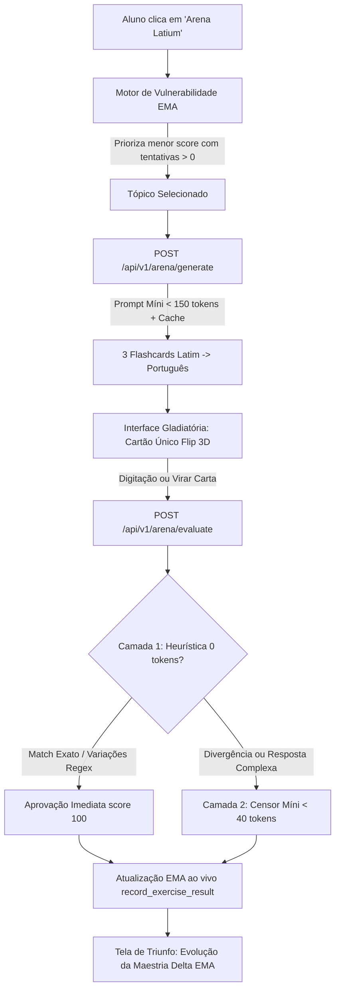

# Walkthrough — Arena Latium (Fase 3: Flashcards Adaptativos & Prompt Míni)

A **Arena Latium** é a terceira e conclusiva peça do ecossistema de retenção de longo prazo do **Latium AI** (ao lado do *Tabularium* e do *Lexicon Universale*). Ela opera como um minigame gladiatório adaptativo que diagnostica fraquezas gramaticais do aluno via **Média Móvel Exponencial (EMA)** e executa rodadas rápidas de 3 flashcards focados, garantindo contenção estrita de custos de LLM por meio de **Prompts Míni (< 150 tokens)** e **Avaliação em Duas Camadas**.

---

## 🏛️ Arquitetura do Sistema e Contenção de Custos



---

## 🛠️ Modificações e Arquivos Entregues

### 1. Backend (FastAPI & SQLAlchemy)

- **Schemas Pydantic ([arena.py](file:///c:/Users/mbpap/OneDrive/Documents/Rodrigo/LATIN_CLASS/backend/app/schemas/arena.py))**:
  - `ArenaFlashcard`: ID do card, sentença em latim, tradução esperada, dica pedagógica e URL do áudio clássico.
  - `ArenaChallengeResponse`: Desafio adaptativo completo contendo tópico selecionado, maestria prévia (`current_mastery`), vulnerabilidade calculada e lista de 3 flashcards.
  - `ArenaEvaluationRequest` & `ArenaEvaluationResponse`: Estruturas para envio da resposta do aluno, nota (0-100), feedback do Censor e rastreamento da maestria antes e depois (`previous_mastery` vs `new_mastery`).
  - `ArenaGenerateRequest`: Permite selecionar um tópico específico ou delegar ao motor adaptativo.

- **Endpoints & Motor Adaptativo ([arena.py](file:///c:/Users/mbpap/OneDrive/Documents/Rodrigo/LATIN_CLASS/backend/app/api/v1/endpoints/arena.py))**:
  - `_select_target_topic(db, user_id)`:
    - **Prioridade 1**: Tópicos com tentativas prévias (`attempts_count > 0`) e maestria vulnerável (`mastery_score < 0.60`), ordenados pelo menor score.
    - **Prioridade 2**: Tópicos com flag de fraqueza (`weakness_flag = True`).
    - **Prioridade 3**: Qualquer tópico já praticado.
    - **Prioridade 4**: Decks canônicos pré-definidos caso o aluno seja recém-cadastrado sem histórico de aulas.
  - `POST /api/v1/arena/generate`:
    - Constrói o Prompt Míni com restrição estrita (`max_tokens=150`) e temperatura controlada (`0.3`).
    - Resolve áudios TTS determinísticos via hash SHA256 (`generate_audio_hash(latin, "onyx")`).
    - Decks canônicos resilientes como fallback offline de altíssima velocidade.
  - `POST /api/v1/arena/evaluate`:
    - **Camada 1 (Zero Custo)**: Normalização de texto (remoção de acentos, pontuação e artigos) e correspondência léxica exata ou aproximada.
    - **Camada 2 (Censor Míni)**: Se houver divergência, aciona o julgador com limite estrito de 40 tokens e validação de sinônimos válidos em português.
    - Atualiza a proficiência em tempo real no banco via `record_exercise_result(db, user.id, [topic_key], score)`, recalculando a EMA instantaneamente.

- **Roteador Global ([api.py](file:///c:/Users/mbpap/OneDrive/Documents/Rodrigo/LATIN_CLASS/backend/app/api/v1/api.py))**:
  - Registrado o endpoint `/arena` no roteador v1 com a tag `"Arena Latium & Adaptive Flashcards"`.

---

### 2. Frontend (React 18, TypeScript, Tailwind CSS)

- **Tipos & Cliente API ([arena.ts](file:///c:/Users/mbpap/OneDrive/Documents/Rodrigo/LATIN_CLASS/frontend/src/types/arena.ts), [arenaApi.ts](file:///c:/Users/mbpap/OneDrive/Documents/Rodrigo/LATIN_CLASS/frontend/src/api/arenaApi.ts))**:
  - Tipagem completa TypeScript para requisições e respostas de geração e avaliação.

- **Página Gladiatória ([ArenaPage.tsx](file:///c:/Users/mbpap/OneDrive/Documents/Rodrigo/LATIN_CLASS/frontend/src/pages/ArenaPage.tsx))**:
  - **Paleta Visual Gladiatória**: Tons de ardósia profunda (`slate-950`), carmim imperial (`red-900`/`red-950`) e dourado clássico (`amber-400`/`amber-500`).
  - **Cartão Único com Flip 3D**:
    - Animações CSS com `transform-style: preserve-3d`, `backface-visibility: hidden` e rotação em `180deg`.
    - Botão de pronúncia clássica latina integrada ([LatinAudioButton.tsx](file:///c:/Users/mbpap/OneDrive/Documents/Rodrigo/LATIN_CLASS/frontend/src/components/common/LatinAudioButton.tsx)).
    - Dica contextual revelada sob demanda (`Exibir Dica Gramatical`).
    - Modos de resposta duplos: digitação com avaliação do Censor ou auto-estudo rápido ("Acertei 👍" / "Preciso Revisar 👎").
  - **Tela de Triunfo (`Triumphus in Arena`)**:
    - Coroas de louros douradas e celebração gladiatória ao concluir os 3 cards.
    - Exibição de acertos da rodada, média de aproveitamento e evolução do EMA (ex: `66% (-5%)` ou `+12%`).
    - Ações rápidas: *Novo Combate na Arena*, *Voltar ao Painel*, ou *Revisar no Tabularium*.

- **Estilos Globais ([index.css](file:///c:/Users/mbpap/OneDrive/Documents/Rodrigo/LATIN_CLASS/frontend/src/index.css))**:
  - Adicionadas classes utilitárias 3D: `.perspective-1000`, `.transform-style-3d`, `.backface-hidden`, `.rotate-y-180`.

- **Navegação Global & Lazy Loading**:
  - [App.tsx](file:///c:/Users/mbpap/OneDrive/Documents/Rodrigo/LATIN_CLASS/frontend/src/App.tsx): Adicionado `ArenaPage` via `React.lazy` para otimização de bundle.
  - [Header.tsx](file:///c:/Users/mbpap/OneDrive/Documents/Rodrigo/LATIN_CLASS/frontend/src/components/layout/Header.tsx): Botão `⚔️ Arena` na barra de navegação superior desktop.
  - [MobileBottomNav.tsx](file:///c:/Users/mbpap/OneDrive/Documents/Rodrigo/LATIN_CLASS/frontend/src/components/layout/MobileBottomNav.tsx): Botão correspondente na barra de navegação móvel de 6 colunas.
  - [DashboardPage.tsx](file:///c:/Users/mbpap/OneDrive/Documents/Rodrigo/LATIN_CLASS/frontend/src/pages/DashboardPage.tsx): Card de ação rápida no painel principal direcionando o aluno à Arena com 1 clique.

---

## 🧪 Verificação e Testes Automatizados

### 1. Testes Unitários de Backend (`pytest`)
Executado dentro do contêiner Docker:
```bash
pytest tests/test_arena.py -v
```
**Resultado:**
- `test_arena_selects_lowest_mastery_topic`: **PASSED** (Verifica priorização do menor score EMA com tentativas prévias)
- `test_arena_evaluation_exact_match_and_ema_increase`: **PASSED** (Verifica Camada 1 heurística com score 100 e incremento do EMA)
- `test_arena_evaluation_error_and_ema_penalty`: **PASSED** (Verifica penalidade do EMA em respostas incorretas)
- **Status:** `3 passed in 11.69s` (100% de sucesso).

### 2. Build do Frontend (`tsc && vite build`)
Executado dentro do contêiner Docker:
```bash
npm run build
```
**Resultado:**
- `dist/assets/ArenaPage-B94uV4eK.js`: `13.75 kB │ gzip: 4.06 kB`
- Zero erros de TypeScript (`tsc` 100% limpo com `noUnusedLocals: true`).
- Lazy chunk gerado perfeitamente.

---

## 🎬 Validação E2E no Navegador

A validação de ponta a ponta com subagente de navegação percorreu todo o ciclo de usuário:
1. **Navegação**: Acesso ao Latium AI via card *"Entrar na Arena"* e link *"Arena"* no Header.
2. **Card 1**:
   - Tópico alvo selecionado dinamicamente: `Verbo Esse (Presente do Indicativo)` (Maestria: 71%).
   - Reprodução de áudio clássico ativada com sucesso.
   - Revelação de dica pedagógica: `💡 Est é a 3ª pessoa do singular do verbo esse.`.
   - Digitação e submissão de resposta.
   - Flip 3D executado exibindo gabarito canônico e feedback do Censor.
3. **Cards 2 e 3**:
   - Flip 3D manual e auto-avaliação imediata.
   - Transições de cards em tempo real.
4. **Tela de Triunfo**:
   - Conclusão do combate com `Triumphus in Arena!`.
   - Exibição de acertos (2 de 3) e recálculo da maestria EMA.
   - Botões de navegação e reinício validados.


A gravação completa da sessão do navegador foi preservada em:
`C:\Users\mbpap\.gemini\antigravity-ide\brain\9b1bd2c6-6a0b-4cb9-b40a-6b75369daf2a\arena_walkthrough_1789682011951.webp`

---

## 🏆 Conclusão do Ecossistema Latium

Com a entrega da **Arena Latium**, o trio fundamental do LMS Latium AI está 100% operacional:
1. **Fase 1 (Tabularium)**: Revisão histórica de pergaminhos com persistência de áudio e zero custo de IA.
2. **Fase 2 (Lexicon & Pugillares)**: Dicionário unificado com favoritos pessoais e pronúncia clássica.
3. **Fase 3 (Arena Latium)**: Treinamento focado em fraquezas gramaticais (EMA) com Prompts Míni e contenção estrita de tokens.
