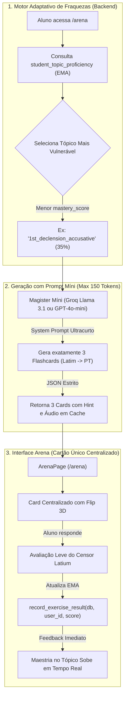
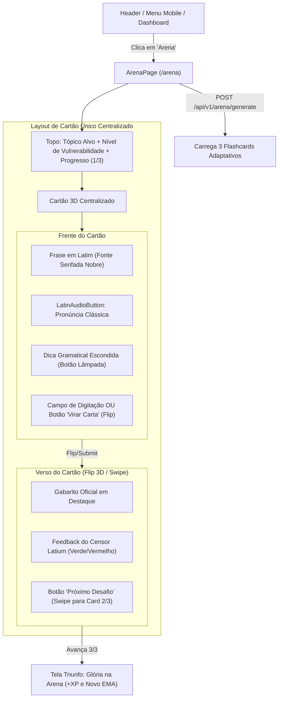

# Arquitetura e Plano de Implementação: Fase 3 — Arena Latium (Flashcards Adaptativos)

**Status:** Aguardando Aprovação do Usuário (Execução Pausada)  
**Objetivo Arquitetural:** Criar a **Arena Latium**, um minigame gamificado de flashcards adaptativos focado na remediação imediata dos pontos fracos do aluno (tópicos com menor *vulnerability_score* / EMA), utilizando **Prompts Míni ultra-restritos** (< 150 tokens) para manter o custo de inferência estritamente baixo, interface de **Cartão Único Centralizado** com animações 3D de *Flip* e *Swipe*, e recálculo dinâmico da maestria do aluno em tempo real.

---

## 1. Visão Geral da Arquitetura & Estratégia de Prompts Míni (Baixo Custo)

Diferente da `ClassroomPage` (que gera planos de aula completos de ~2.000 tokens com teoria, 4 diálogos, vocabulário e múltiplos exercícios), a **Arena Latium** utiliza uma arquitetura de micro-inferência cirúrgica:



---

## 2. Motor de Seleção de Vulnerabilidade (EMA)

O backend utilizará o modelo `StudentTopicProficiency` já alimentado nas lições anteriores.

### 2.1. Algoritmo de Seleção do Alvo da Arena:
1. Consulta todos os registros de `StudentTopicProficiency` para o `current_user.id`.
2. Calcula o `vulnerability_score = 1.0 - mastery_score`.
3. **Critério de Priorização:**
   - **Prioridade 1:** Tópicos já testados (`attempts_count > 0`) com status vulnerável (`mastery_score < 0.60`), ordenados pelo menor `mastery_score` (maior vulnerabilidade).
   - **Prioridade 2:** Tópicos que possuem bandeiras de fraqueza (`weakness_flags`).
   - **Prioridade 3:** Se o aluno já dominou todos os tópicos tentados, seleciona o próximo tópico curricular canônico ainda não iniciado (`attempts_count == 0`), estimulando expansão de repertório.
4. O tópico selecionado é retornado com seu nome legível em português (ex: *"1ª Declinação (Caso Acusativo)"*), sua porcentagem atual de maestria (ex: 35%) e suas fraquezas específicas mapeadas.

---

## 3. Desenho dos Prompts Míni de Baixo Custo

### 3.1. Prompt Míni de Geração de Flashcards (`POST /api/v1/arena/generate`)
- **Modelo:** `ModelRole.ROUTER` (Groq Llama 3.1 8B instantâneo / custo quase nulo) ou `ModelRole.TUTOR` (gpt-4o-mini com `max_tokens=150`).
- **Temperatura:** `0.3` (determinístico e rigoroso).
- **System Prompt:**
```text
Você é o Magister Latium Arena.
Gere exatamente 3 flashcards ultracurtos em Latim focados exclusivamente no tópico '{topic_name}' ({topic_key}).
Cada cartão deve ter uma frase ou expressão curta em Latim e sua tradução em Português.
Retorne estritamente em JSON válido:
{"cards":[{"id":1,"latin":"...","translation":"...","hint":"..."}]}
Máximo 120 tokens. Sem explicações.
```

### 3.2. Formato do JSON de Saída (JSON Schema Estrito):
```json
{
  "topic_key": "1st_declension_accusative",
  "topic_label": "1ª Declinação (Caso Acusativo)",
  "current_mastery": 0.35,
  "vulnerability_score": 0.65,
  "cards": [
    {
      "id": 1,
      "latin": "Puellam video.",
      "translation": "Eu vejo a menina.",
      "hint": "Observe a desinência em -am de objeto direto.",
      "audio_url": "/api/v1/media/audio/7a1b...mp3"
    },
    {
      "id": 2,
      "latin": "Nauta rosam amat.",
      "translation": "O marinheiro ama a rosa.",
      "hint": "Rosam é o acusativo singular de rosa.",
      "audio_url": "/api/v1/media/audio/4c2d...mp3"
    },
    {
      "id": 3,
      "latin": "Agricola villam aedificat.",
      "translation": "O agricultor constrói a casa de campo.",
      "hint": "Villam indica o que é construído.",
      "audio_url": "/api/v1/media/audio/9f8e...mp3"
    }
  ]
}
```

### 3.3. Prompt Míni de Avaliação Leve (`POST /api/v1/arena/evaluate`)
Para respostas digitadas pelo aluno, utilizamos uma avaliação em duas camadas:
1. **Camada 1 (Custo Zero de IA):** Verificação de correspondência exata ou normalizada com a tradução esperada via regex/string matching. Se bater, retorna nota 100 imediatamente sem chamar LLM.
2. **Camada 2 (Censor Míni - Max 40 Tokens):** Se a tradução divergir por sinônimos, aciona o Censor Míni:
```text
Você é o Censor Latium Míni.
Latim: "{latin}"
Gabarito: "{expected}"
Resposta do aluno: "{student_answer}"
A tradução está semanticamente correta em português?
Responda em JSON: {"is_correct": boolean, "score": int, "feedback": "uma frase curta"}
```
3. **Atualização Automática do EMA:**
   - O endpoint chama imediatamente `record_exercise_result(db, user_id, [topic_key], score)` em `backend/app/services/proficiency.py`.
   - O novo `mastery_score` é retornado na resposta, permitindo ao frontend animar a barra de maestria subindo imediatamente!

---

## 4. Arquitetura do Backend (Novas Rotas & Schemas)

### 4.1. Schemas Pydantic (`backend/app/schemas/arena.py`) [NOVO]
```python
from pydantic import BaseModel, Field


class ArenaFlashcard(BaseModel):
    id: int
    latin: str
    translation: str
    hint: str
    audio_url: str


class ArenaChallengeResponse(BaseModel):
    challenge_id: str
    topic_key: str
    topic_label: str
    current_mastery: float
    vulnerability_score: float
    cards: list[ArenaFlashcard]


class ArenaEvaluationRequest(BaseModel):
    topic_key: str
    card_id: int
    latin: str
    expected_answer: str
    student_answer: str


class ArenaEvaluationResponse(BaseModel):
    card_id: int
    is_correct: bool
    score: int
    feedback: str
    previous_mastery: float
    new_mastery: float
```

### 4.2. Endpoints do Router (`backend/app/api/v1/endpoints/arena.py`) [NOVO]
- `POST /api/v1/arena/generate`:
  - Recebe opcionalmente `{ "topic_key": null }`.
  - Encontra o tópico mais vulnerável do aluno.
  - Gera os 3 flashcards via Prompt Míni (com fallback canônico determinístico para testes e offline).
  - Resolve os hashes de áudio para streaming de pronúncia clássica.
- `POST /api/v1/arena/evaluate`:
  - Valida a resposta do aluno com Camada 1 (heurística) + Camada 2 (Censor Míni).
  - Atualiza o registro EMA em `StudentTopicProficiency`.
  - Retorna o veredito e o novo valor de maestria.

---

## 5. Arquitetura do Frontend (React & TypeScript)



### 5.1. Tipos & API Client (`frontend/src/types/arena.ts` e `frontend/src/api/arenaApi.ts`) [NOVOS]
- Tipagem completa TypeScript para as requisições e respostas de geração e avaliação.

### 5.2. Página da Arena (`frontend/src/pages/ArenaPage.tsx`) [NOVO]
- **Estética da Arena Gladiatória:**
  - Tons nobres de ardósia escura, carmim imperial, bordas douradas e tochas romanas.
  - Formato minimalista e imersivo, **descartando o scroll longo da Classroom**.
- **Animações e Interatividade:**
  - **Flip 3D:** Implementado via CSS 3D (`perspective: 1000px`, `transform-style: preserve-3d`, `transition: transform 0.6s cubic-bezier(0.4, 0, 0.2, 1)`).
  - **Swipe / Slide:** Transição suave entre cartões com classes de translação Tailwind (`translate-x-0` -> `-translate-x-full` -> entrada com fade-in).
  - **Modos Flexíveis de Estudo:**
    - *Modo Rápido (Autoavaliação):* O aluno lê o Latim, tenta lembrar a tradução, vira a carta e clica em *"Acertei 👍"* ou *"Preciso Revisar 👎"*.
    - *Modo Censor (Digitação):* O aluno digita sua tradução e envia para validação do Censor Míni.
- **Tela de Vitória (Triumphus):**
  - Ao completar os 3 flashcards, exibe o cartão final de vitória:
    - *Pontuação do Combate* (ex: 3 de 3 acertos).
    - *Evolução da Maestria* com barra animada (ex: *Acusativo subiu de 35% para 50%*).
    - Botões: *"Novo Duelo na Arena"* (gera outro conjunto adaptativo) e *"Retornar ao Painel"*.

### 5.3. Integração na Navegação
- **`App.tsx`:** Inclusão da tab `'arena'` no `MainTab` e lazy load da `ArenaPage`.
- **`Header.tsx` & `MobileBottomNav.tsx`:** Adição do botão da Arena com ícone de espada/escudo (`Swords` ou `Shield`).
- **`DashboardPage.tsx`:** Card de destaque *"⚔️ Arena Latium: Treino Focado de Fraquezas"* com link direto.

---

## 6. Plano de Verificação e Testes

### Backend
1. **Testes Pytest (`backend/tests/test_arena.py`) [NOVO]:**
   - `test_arena_selects_lowest_mastery_topic`: Verifica que o motor seleciona com precisão o tópico com menor pontuação EMA.
   - `test_arena_generation_mini_prompt_limit`: Verifica que o prompt de geração é conciso e respeita a restrição de tokens.
   - `test_arena_evaluation_and_ema_update`: Valida que responder ao flashcard atualiza imediatamente o `mastery_score` do tópico no banco.
2. **Linter & Tipos:**
   - `ruff check app/ tests/` (100% limpo).

### Frontend
1. **Compilação TypeScript:**
   - `tsc && vite build` (garantir 0 erros de tipagem).
2. **Validação E2E com Browser Subagent:**
   - Navegar para `/arena`.
   - Verificar carregamento do tópico mais vulnerável do estudante `meiodarua@gmail.com`.
   - Testar reprodução do áudio clássico na frente do cartão.
   - Testar animação de Flip revelando o gabarito.
   - Avançar pelos 3 cartões do round e verificar a tela final com aumento de maestria.

---

## 7. Solicitação de Aprovação

> [!IMPORTANT]
> **Pausa de Execução Ativa:**
> Conforme solicitado estritamente, **nenhum arquivo de código foi alterado**. 
> Aguardo sua revisão e aprovação deste plano técnico para darmos início à implementação da **Fase 3: Arena Latium**.
