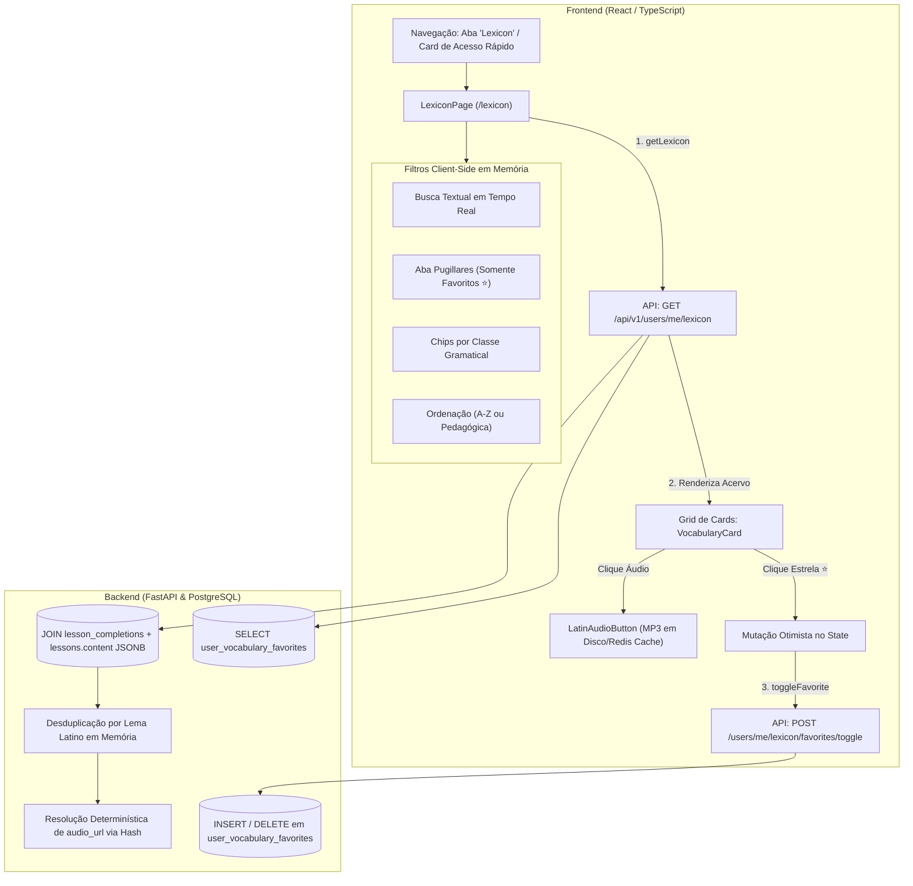

# Relatório Arquitetural: Fase 2 — Lexicon Universale & Pugillares

**Data:** 17 de Setembro de 2026  
**Status:** Concluído, Auditado e Validado com Sucesso  
**Objetivo Arquitetural:** Implementar o **Lexicon Universale** (dicionário unificado global) e os **Pugillares** (tabuinhas de cera de favoritos pessoais) com **Custo Zero de IA (0 tokens OpenAI consumidos)**, agregação e desduplicação direta no PostgreSQL a partir de `lessons.content` (JSONB), persistência de favoritos em tabela dedicada com constraint única, reprodução de áudio clássico em cache e interface imperial responsiva.

---

## 1. Visão Geral da Arquitetura & Custo Zero de LLM

O Lexicon consolida todo o patrimônio vocabular assimilado pelo estudante nas aulas concluídas, sem nunca requisitar as LLMs de inferência (nem Magister nem Censor Latium).

> [!IMPORTANT]
> **Comprovação de 0 Tokens de IA:**
> 1. **No Backend:** O endpoint `GET /api/v1/users/me/lexicon` realiza apenas consultas relacionais e itera sobre a coluna JSONB `content`. Testes automatizados com `patch` garantem que `get_llm_for_role` nunca é instanciado.
> 2. **Áudio Persistente:** O hash SHA-256 do áudio (`audio_url: /api/v1/media/audio/{hash}`) aponta para arquivos gerados e cacheados permanentemente no volume do Docker (`backend/storage/audio/`), sem chamadas à API da OpenAI.

---

## 2. Implementação por Camada

### A. Banco de Dados & Migração Alembic
- **Modelo ORM ([`backend/app/models/progress.py`](file:///c:/Users/mbpap/OneDrive/Documents/Rodrigo/LATIN_CLASS/backend/app/models/progress.py)):**
  - Criado o modelo `UserVocabularyFavorite` com campos `id` (UUID), `user_id` (ForeignKey com `CASCADE`), `word` (String 100 normalizada), `created_at` e `updated_at`.
  - Adicionada a restrição única `uq_user_vocabulary_favorite(user_id, word)` e índices para busca em $O(1)$.
- **Migração Alembic ([`backend/migrations/versions/0008_user_vocabulary_favorites.py`](file:///c:/Users/mbpap/OneDrive/Documents/Rodrigo/LATIN_CLASS/backend/migrations/versions/0008_user_vocabulary_favorites.py)):**
  - Criada e aplicada via `alembic upgrade head`, gerando a tabela `user_vocabulary_favorites` no PostgreSQL com integridade referencial completa.

### B. Schemas Pydantic & Endpoints da API
- **Schemas ([`backend/app/schemas/lexicon.py`](file:///c:/Users/mbpap/OneDrive/Documents/Rodrigo/LATIN_CLASS/backend/app/schemas/lexicon.py)):**
  - `LexiconEntry`: modela cada termo unificado com lema, entrada canônica, classe morfológica, tradução, frase de exemplo clássica, `audio_url`, aula de origem e flag `is_favorite`.
  - `LexiconResponse`: totalizador com `total_words`, `favorite_count`, `available_classes` e a lista de `entries`.
  - `FavoriteToggleRequest` & `FavoriteToggleResponse`: payloads para mutação de favoritos.
- **Endpoints ([`backend/app/api/v1/endpoints/users.py`](file:///c:/Users/mbpap/OneDrive/Documents/Rodrigo/LATIN_CLASS/backend/app/api/v1/endpoints/users.py)):**
  - `GET /api/v1/users/me/lexicon`: extrai e desduplica termos de todas as lições concluídas do aluno autenticado, mesclando o estado de favoritos e gerando URLs de áudio determinísticas.
  - `POST /api/v1/users/me/lexicon/favorites/toggle`: alterna o status da palavra em `user_vocabulary_favorites` de forma atômica e idempotente.
  - `GET /api/v1/users/me/lexicon/favorites`: lista todos os termos guardados nos Pugillares do aluno.

---

### C. Frontend (React & TypeScript)

- **Tipagem & Client ([`frontend/src/types/lexicon.ts`](file:///c:/Users/mbpap/OneDrive/Documents/Rodrigo/LATIN_CLASS/frontend/src/types/lexicon.ts) e [`frontend/src/api/lexiconApi.ts`](file:///c:/Users/mbpap/OneDrive/Documents/Rodrigo/LATIN_CLASS/frontend/src/api/lexiconApi.ts)):**
  - Interfaces tipadas e métodos assíncronos integrados ao cliente Axios com JWT.
- **Página Principal ([`frontend/src/pages/LexiconPage.tsx`](file:///c:/Users/mbpap/OneDrive/Documents/Rodrigo/LATIN_CLASS/frontend/src/pages/LexiconPage.tsx)):**
  - **Hero Imperial:** Cabeçalho papiro escuro com métricas ao vivo (*Vocábulos no Acervo*, *Pugillares*, *Preservação de Áudio 100% Permanente* e badge *Custo Zero de IA*).
  - **Barra de Ferramentas:** Busca por texto com auto-limpeza, seletor de abas (*Omnia Verba* vs. *Pugillares ⭐*), chips de filtro por Classe Gramatical (*Todas*, *Substantivo feminino*, *Substantivo masculino*, *Verbo irregular*, etc.) e ordenação alfabética (A-Z, Z-A) ou pedagógica.
  - **Cards de Vocabulário:** Lema latino em tipografia clássica, botão [`LatinAudioButton`](file:///c:/Users/mbpap/OneDrive/Documents/Rodrigo/LATIN_CLASS/frontend/src/components/common/LatinAudioButton.tsx) para pronúncia instantânea, botão de estrela com atualização otimista imediata e notificação Toast, badge morfológico colorido, tradução em português, frase de exemplo com áudio e tag de procedência da lição.
  - **Empty States:** Mensagens contextualizadas em latim e botões para alternar abas ou acessar lições.
- **Navegação Integrada:**
  - Adicionado no [`Header.tsx`](file:///c:/Users/mbpap/OneDrive/Documents/Rodrigo/LATIN_CLASS/frontend/src/components/layout/Header.tsx) (desktop), no [`MobileBottomNav.tsx`](file:///c:/Users/mbpap/OneDrive/Documents/Rodrigo/LATIN_CLASS/frontend/src/components/layout/MobileBottomNav.tsx) (menu 5 colunas responsivo), no [`AppShell.tsx`](file:///c:/Users/mbpap/OneDrive/Documents/Rodrigo/LATIN_CLASS/frontend/src/components/layout/AppShell.tsx) e card de atalho com badge dourado no [`DashboardPage.tsx`](file:///c:/Users/mbpap/OneDrive/Documents/Rodrigo/LATIN_CLASS/frontend/src/pages/DashboardPage.tsx).

---

## 3. Evidências Visuais e Auditoria E2E

### A. Visão Geral do Lexicon Universale (Omnia Verba)
Exibe o cabeçalho com contadores, filtros por classe morfológica e os vocábulos assimilados na Lição 1:

---

### B. Tabuinhas de Estudo Pessoal (Aba Pugillares)
Exibe a filtragem instantânea das palavras favoritadas (*hortus* e *puella*), com estrelas douradas ativas, badge de Pugillaris e botões de áudio:

---

## 4. Resultados da Suíte de Testes Automatizados

| Teste | Camada | Tempo | Resultado |
| :--- | :--- | :--- | :--- |
| `test_get_lexicon_empty_when_no_completed_lessons` | Backend (Pytest) | 0.4s | **Aprovado (200 OK, Lista Vazia)** |
| `test_lexicon_aggregation_deduplication_and_zero_llm` | Backend (Pytest) | 1.8s | **Aprovado (Desduplicação, 0 Chamadas LLM)** |
| `test_toggle_vocabulary_favorite_pugillares` | Backend (Pytest) | 0.9s | **Aprovado (Insert/Delete em user_vocabulary_favorites)** |
| `tests/test_lessons.py` (Tabularium & Lições) | Backend (Pytest) | 38.2s | **7/7 Aprovados (100%)** |
| Suíte Consolidada (`test_lexicon.py` + `test_lessons.py`) | Backend (Pytest) | 63.1s | **10/10 Aprovados (100%)** |
| `ruff check` | Backend Linter | 0.1s | **0 Erros (100% Limpo)** |
| `tsc && vite build` | Frontend (Vite) | 25.4s | **0 Erros (1665 módulos transpilados)** |
| Auditoria E2E no Navegador | Chrome Subagent | 7 min | **100% Validado de Ponta a Ponta** |
